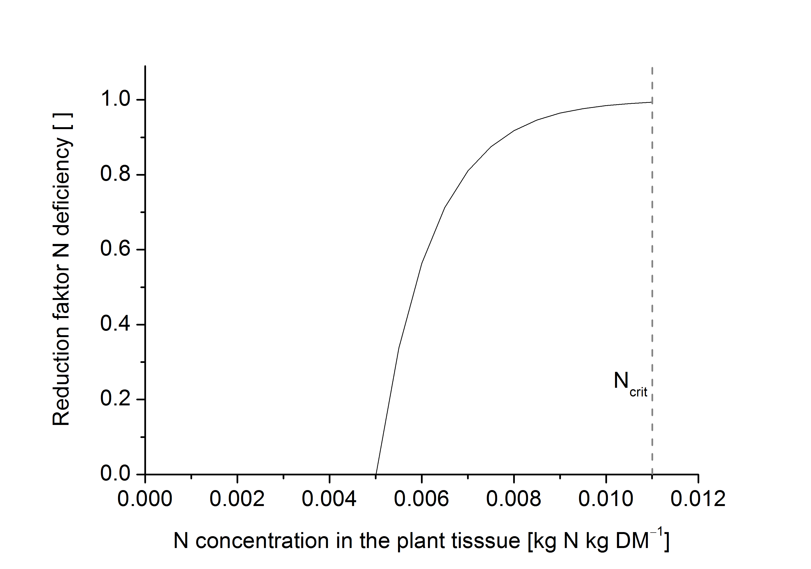

# Nitrogen deficiency

Nitrogen deficiency is indicated as soon as the crop’s tissue N concentration falls below the critical N concentration. The respective reduction factor results from

$`\small \zeta_N = 1-e^{N_m - \left( 5\cdot \frac{N_{act} - N_m} {N_{crit} - N_m}  \right)} `$

$`\small \zeta_N `$	Reduction factor N stress	  
$`\small N_m`$	Minimum N concentration in the plant tissue	$`\small [kg \, N \, kg \, TM^{-1}] `$ 
$`\small N_{act}`$	Actual N concentration in the plant tissue	$`\small [kg \, N \, kg \, TM^{-1}] `$ 
$`\small N_{crit}`$	Critical N concentration in the plant tissue	$`\small [kg \, N \, kg \, TM^{-1}] `$ 

Figure 1: Reduction function for N stress in relation to the actual N concentration of the above-ground biomass. Ncrit = critical N concentration.

In the case of stress due to drought or nitrogen deficiency acceleration of ontogenesis is assumed for some developmental stages.

## References
Challinor et al. (2005): Simulation of the impact of high temperature stress on annual crop yields. Agricultural and Forest Meteorology 135, 180 - 189.

Mirschel, W. & Wenkel, K.-O., 2007. Modelling soil-crop interactions with AGROSIM model family. In: K.C. Kersebaum, J.-M. Hecker, W. Mirschel and M. Wegehenkel (Editors), Modelling water and nutrient dynamics in soil crop systems. Springer, Stuttgart, pp. 59- 74.

Moriondo et al. (2011): Climate change impact assessment: the role of climate extremes in crop yield simulation. Climatic Change 104 (3-4), 679-701.